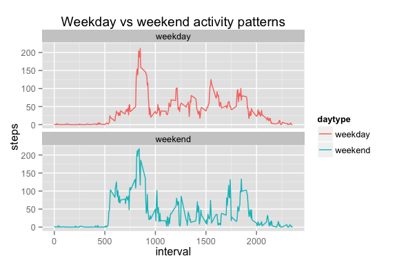

# Reproducible Research: Peer Assessment 1


### Loading and preprocessing the data

```r
library(plyr)
data <- read.csv("activity.csv")
dailyact <- ddply(data, .(date), summarize, steps = sum(steps))
dailyact_mean <- as.character(round(mean(dailyact$steps, 
                                         na.rm = TRUE),digits=2))
dailyact_median <- median(dailyact$steps, na.rm = TRUE)
```
Mean number of steps per day: 10766.19
Median number of steps per day: 10765

### Histogram plot

```r
hist(dailyact$steps, breaks=10, main="Histogram of steps/day", xlab="steps")
```

 

### What is the average daily activity pattern?

```r
daily_pattern <- ddply(data, .(interval), summarize, steps = mean(steps, na.rm=TRUE))
max_steps <- max(daily_pattern$steps)
max_int <- daily_pattern[daily_pattern$steps==max(max_steps),1]
plot(daily_pattern,type="l")
```

 
Interval with max number of steps: 835.

### Imputing missing values 

```r
ind_na <- which(is.na(data$steps))
num_missing <- length(ind_na)
missing_intervals <- data$interval[ind_na]
medsteps <- ddply(data, .(interval), summarize, steps = mean(steps, na.rm=TRUE))
medact <- data
medact[ind_na,1] <- medsteps[as.factor(data[ind_na,3]),2]
dailyact <- ddply(medact, .(date), summarize, steps = sum(steps))
medact_mean <- as.character(round(mean(dailyact$steps),digits=2))
medact_median <- as.character(round(median(dailyact$steps)))
hist(dailyact$steps, breaks=10, main="Histogram of steps/day", xlab="steps")
```

 

Number of missing rows: 2304.

There are many possibilities for imputing missing values.One simple strategy is to exchange the missing value for each 5 minute interval with an aggregated value over the distribution of intervals over days. First thought was to use the mode (the most common value) of steps per interval, but it turns out that the mode in all cases equals zero, so it seems a bit boring choice. The next idea was to use the median, which has a similar effect to that of the mode, but finally settled for the mean, due to how the missing values appear in the data as a consecutive run of NAs.

Mean number of steps per day after imputing missing values: 10766.19.
Median number of steps per day after imputing missing values: 10766.


### Are there differences in activity patterns between weekdays and weekends?

```r
library(ggplot2)
days <- weekdays(as.POSIXct.Date(medact$date))
medact$daytype <- days == "Saturday" | days == "Sunday"
medact$daytype[medact$daytype==TRUE] = "weekend"
medact$daytype[medact$daytype==FALSE] = "weekday"
wday_act <- ddply(medact, .(interval,daytype), summarize, steps = mean(steps))

ggplot(data=wday_act, aes(x=interval, y=steps, group=daytype)) + geom_line(aes(color=daytype))+ facet_wrap(~ daytype, nrow=2) +
labs(title="Weekday vs weekend activity patterns")
```

 

It seems like there is a difference in weekday vs weekend step count data. I am surprised to see activity start earlier on weekends than on weekdays, maybe this user is just that kind of person... not so for me. I went through the data and looked at each single day of the week to try to track down a possible bug in my code but looking at individual days the weekend/weekday result seemed to make sense. Still not excluding the possibility of a bug.
